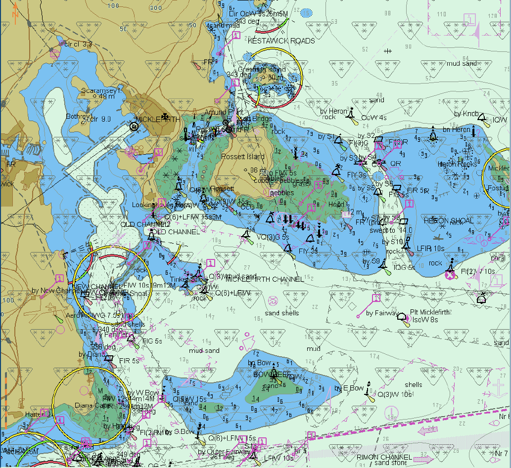

//
// this is the main body of the document
//
=== Document Structure
Explanation of document structure

=== An Example Test.
This is an example of a test generated from ASCIIDOC straight to PDF. the test itself is included in the tests subfolder and any images included in the tests/images subfolder. Once this is done, the main s64v4.adoc file just includes the test and it is automatically included in the final PDF and HTML documents.

The asciidoc file contents used to create the test in the following chapter is shown in the text below:

[%autofit,source,xml]
----
==== Loading a Corrupted update

===== Corrupted update load.

[width="95%",caption="",stripes="odd"]
|====================
|Test Reference    |    2.2.1   | IHO Reference | IEC61174 / 4.4.1
|====================
[width="95%",caption="",stripes="odd"]
|====================
|Test Description
|Loading of initial datasets and indication of own ship stationary position.
|Setup
a| Load cells:

* 2.1.1 Power Up\ENC_ROOT\GB4X0000.000
* 2.1.1 Power Up\ENC_ROOT\GB5X01NW.000 with the following settings:
* Select Display Category Other
* Set the Safety Contour value to 8 m
* Set the Safety Depth value to 8 m
* Select Symbolized Boundaries
* Select Paper chart symbols
* Select all Text groups
* Select Accuracy
* Select Highlight info
* Select Highlight date dependent
* Ship position 32°29.66’S, 060°55.86’E
* Heading 234.0 degrees
| Action
| Load cells and view the chart display.
| Results
a| With the charts displayed the own ship shall be placed at the jetty in Micklefirth.

.GB4X0000.000

_After loading of GB4X0000.000, displayed scale 1:50 000 Note: Screen plot above is based on the full text NATSUR attribute. To reduce undue clutter in the ECDIS chart display, the use of the abbreviations of the NATSUR attribute is recommended (see screen plot on next page). Note: Within this test dataset there are two omni directional lights co-located at 32º34.688S, 060º54.955E, this case is not a real-world example, as such the ECDIS may show a red-light sector._
|====================
----

=== Tests

include::tests/2.2.1.adoc[]
= Chart Loading and Unloading

== Chart Display

=== Display of ENC data

include::tests/3.1.1.adoc[]
include::tests/3.1.2.adoc[]
